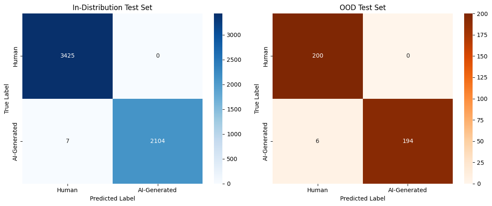

# AI-Generated Text Detector


A binary text classifier that distinguishes **human-written** from **AI-generated** essays, fine-tuned on RoBERTa-base with full MLflow experiment tracking and Docker deployment.

---

## What Makes This Project Different

Most AI text detection projects report inflated metrics due to data leakage. This project explicitly audits and fixes those issues:

- Discovered **1,805 duplicate texts** and **topic clustering** causing data leakage in the original dataset
- Identified **661 template artifacts** (`[Your Name]` placeholders) that made AI detection trivially easy
- Fixed train/test split methodology — replaced random split with stratified split by topic group
- Conducted **OOD evaluation** revealing 54% accuracy on unseen data after initial training
- Augmented training set with diverse human writing improving OOD performance to **98.5%**

---

## Results

| Evaluation | Score |
|---|---|
| In-distribution Accuracy | 99.8% |
| In-distribution F1 | 99.8% |
| OOD Accuracy | 98.5% |
| OOD F1 | 98.5% |

### Confusion Matrix


---

## Model Details

| Component | Detail |
|---|---|
| Architecture | RoBERTa-base |
| Task | Binary sequence classification |
| Framework | PyTorch + HuggingFace Transformers |
| Optimizer | AdamW (lr=2e-5) |
| Scheduler | Linear warmup (10% steps) |
| Mixed Precision | float16 via GradScaler |
| Experiment Tracking | MLflow |
| Deployment | Flask + Docker |

---

## Dataset

- **Training:** Kaggle AI-generated essays dataset (26,679 rows after cleaning)
- **Augmentation:** 1,000 essays from Deep Essays dataset (Aeon Magazine) added to training
- **OOD Test:** 200 held-out Deep Essays + 200 GPT-4 generated essays

---

## Known Limitations

- Trained primarily on formal academic essays — performance may degrade on casual text, social media, or emails
- AI class contains only GPT-4 generated text — may not generalize to Claude, Gemini, or other models
- OOD test set shares writing style with augmented training data — not fully adversarial

---

## MLOps

All experiments tracked with MLflow:
- Parameters logged per run (lr, batch size, dropout, scheduler)
- Metrics logged per epoch (train loss, val F1, val accuracy)
- Confusion matrix logged as artifact
- Best model registered in MLflow Model Registry as `AI-Text-Detector v1`

---

## Project Structure

```
AI-Generated-Text-Detector/
├── app.py                        # Flask inference API
├── Dockerfile                    # Container definition
├── requirements.txt
├── .gitignore
├── notebooks/
│   └── Model_training.ipynb      # Full training pipeline
├── assets/
│   ├── gui/
│   │   ├── static/styles.css     # Web interface styling
│   │   └── templates/index.html  # Web interface template
│   ├── models/
│   │   └── saved_model/          # RoBERTa model files
│   └── confusion_matrix.png      # Evaluation results
├── data/
│   └── README.md                 # Dataset download instructions
└── README.md
```

---

## Usage

### Run with Docker

```bash
docker build -t ai-detector .
docker run -p 5001:5001 ai-detector
```

Then open `http://localhost:5001` in your browser.

### Train from scratch

1. Open `notebooks/Model_training.ipynb` in Google Colab
2. Mount Google Drive and upload datasets
3. Run all cells in order
4. Download saved model and place in `assets/models/saved_model/`

---

## Author

**Mridupawan Gogoi**

---

## License

MIT License